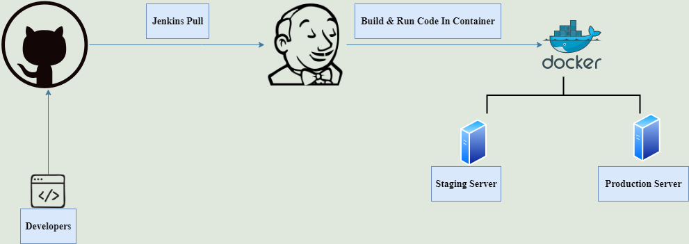
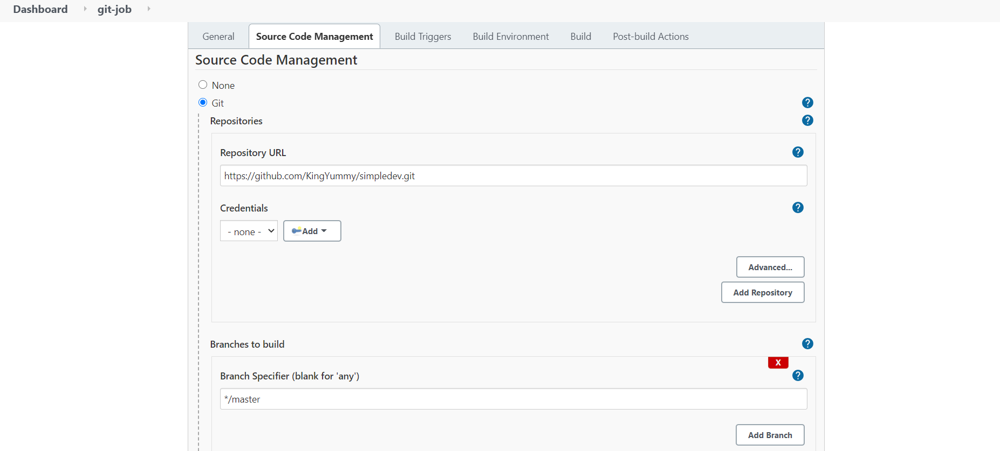
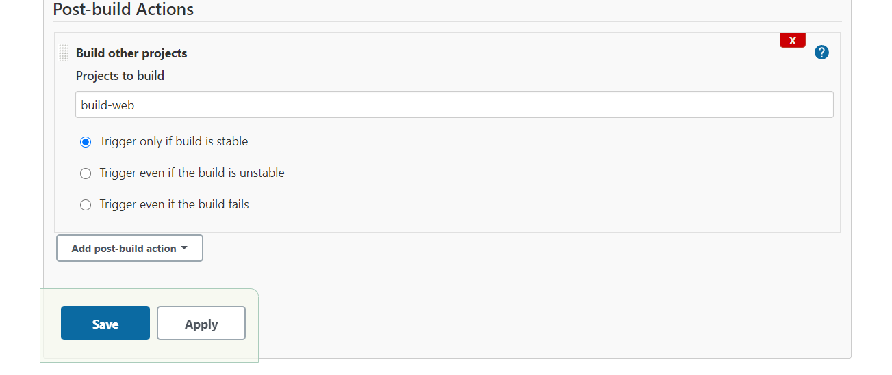
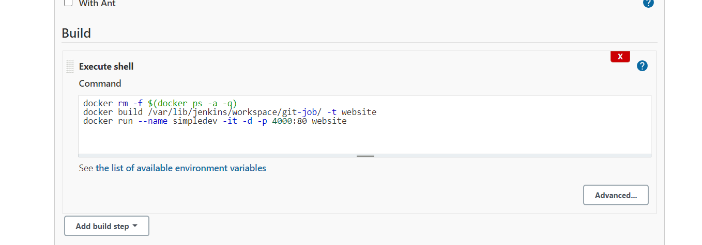

# CI/CD Pipeline Using Jenkins to Deploy Into a Docker Container 



## Technology

-Git, Jenkins  and Docker

## Requirements 

-Set up a Jenkins Master-Slave Architecture: one master and two slaves (Staging Server and Production Server)

## Summary

- Developers pushes code to Github. A Webhook connection between the Jenkins server and github ensures that everytime a change is made on the source code,a sequence of jenkins jobs gets triggered. 
- The first Jenkins job which is to get the souce code, triggers the next on successful completion. (Done on the Staging server)
- The second job which is to build the docker image and run a container from it also triggers the next job (Done on the Staging server)
- The final job is also triggered by the successful completion of the second job. This job deploys the stable app on the Production Server

### Job 1



 - A Jenkins Pull: The latest version of the code is pulled. This job is restricted to run only on the Staging server (One of the worker nodes in the Jenkins Master-Slave Architecture)

The Postbuild-Action is set to "Trigger only if build is stable" The next job to build is then selected.
 


### Job 2

- Docker Image Build and Run: In this job, the Dockerfile is used to build the Docker Image. The newly created image is then run to create a new container

Note: this job is also restricted to run only on the Staging server

In the build section, Execute shell is selected. The commands:


```
docker rm -f $(docker ps -a -q)
docker build /var/lib/jenkins/workspace/git-job/ -t website
docker run --name simpledev -it -d -p 4000:80 website
```





The Postbuild-Action is also set to "Trigger only if build is stable" The final job to build is then selected

### Job 3

Final Job: would be the combination of both jobs : To pull code from Github and then run the commands to build the image from the Dockerfile and also run a container using the image created.
Note: This Job would be restricted to run on the Production Server (One of the worker nodes in the Jenkins Master-Slave Architecture)

3. Set up Webhook to iniate the cycle whenever there is an update to the source code in Github.


